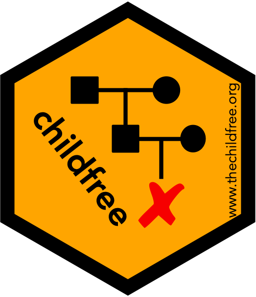

# childfree 

<!-- badges: start -->

[](https://cran.r-project.org/package=childfree)
[](https://cran.r-project.org/package=childfree)
[](https://cran.r-project.org/package=childfree)
<!-- badges: end -->

## Welcome
Welcome to the `childfree` package\! The childfree package accesses demographic data from a variety of public data sources, extracting and harmonizing variables useful for the study of childfree individuals. For more information about childfree individuals, visit [https://www.thechildfree.org](https://www.thechildfree.org).

The `childfree` package can be cited as:

**Neal, Z. P. and Neal, J. W. (2024). childfree: An R package to access and harmonize childfree demographic data. *Comprehensive R Archive Network*. https://doi.org/10.32614/CRAN.package.childfree**

## Installation
The /release branch contains the current CRAN release of the childfree package. You can install it from [CRAN](https://CRAN.R-project.org) with:
``` r
install.packages("childfree")
```

The /devel branch contains the working beta version of the next release of the childfree package. All the functions are documented and have undergone various levels of preliminary debugging, so they should mostly work, but there are no guarantees. Feel free to use the devel version (with caution), and let us know if you run into any problems. You can install it You can install from GitHub with:
``` r
library(devtools)
install_github("zpneal/childfree", ref = "devel", build_vignettes = TRUE)
```

## Dependencies
The `childfree` package adopts the [tinyverse](https://www.tinyverse.org/) philosophy, and therefore aims to keep dependencies at a minimum.

## Contribute
You can support the development of the childfree package by making a tax-deductible contribution to Michigan State University's [Childfree Research Fund](https://givingto.msu.edu/gift/?sid=17582).
